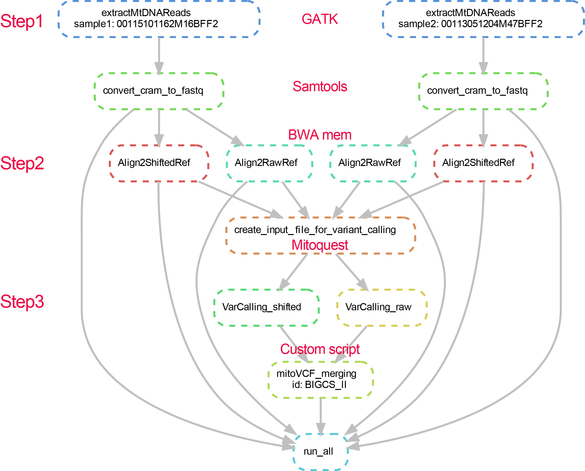

# **MitoQuest Pipeline: Mitochondrial DNA Variant Calling Pipeline**
## **Overview**
The MitoQuest pipeline is a comprehensive set of tools and scripts designed for processing and analyzing mitochondrial DNA (mtDNA) sequencing data. It addresses specific challenges in mtDNA analysis such as accurate read alignment considering the circular genome structure, heteroplasmy detection, and variant calling . The pipeline efficiently processes CRAM/BAM files to identify mitochondrial variants including SNPs, insertions, and deletions.

## **Workflow Description**
The MitoQuest pipeline consists of three main analytical stages:



### **1. mtDNA Read Extraction**
This initial step involves extracting mitochondrial DNA reads from CRAM/BAM files that have been aligned to both the nuclear and mitochondrial genomes during the WGS process. This ensures comprehensive capture of mtDNA sequences while addressing the challenge of nuclear mitochondrial sequences (NUMTs) that can cause false positives in variant calling.

### **2. mtDNA Realignment**
The extracted mtDNA undergoes a sophisticated realignment process using a "double alignment" strategy to account for the circular nature of the mitochondrial genome:
- Primary alignment​ to the standard mitochondrial reference (rCRS)
- Secondary alignment​ to an mtDNA reference shifted by 8,000 bp to address breakpoint artifacts in circular genome alignment

This approach significantly improves read depth accuracy, particularly around the artificial breakpoints introduced when linearizing the circular mtDNA for analysis.

### **3. mtDNA Variant Detection**
The final stage performs comprehensive variant calling on the realigned mtDNA sequences, detecting:

- Single nucleotide polymorphisms (SNPs)
- Insertions (INS)
- Deletions (DEL)

The pipeline leverages specialized in-house variant callers, and subsequently merges the variants detected from both alignments to generate a comprehensive variant set.

## **Quick Start**
Firstly, put the input CRAM or BAM files—pre-aligned to both nuclear and mitochondrial genomes during whole-genome sequencing (WGS) analyses — into the input/cram/
```bash
$ tree input/cram/
    input/cram/
    |-- 00113051204M47BFF2.sorted.markdup.BQSR.cram
    |-- 00113051204M47BFF2.sorted.markdup.BQSR.cram.crai
    |-- 00115101162M16BFF2.sorted.markdup.BQSR.cram
    `-- 00115101162M16BFF2.sorted.markdup.BQSR.cram.crai
```

```bash
smk=./run.all.smk
snakemake -c $threads -pk -s ${smk} 2> snakemake.err.txt
```

## **Prerequisites**
### **Software Dependencies**
- GATK​ (Genome Analysis Toolkit) - Variant calling and processing 
- SAMtools​ - BAM/CRAM file manipulation and indexing 
- BWA​ (Burrows-Wheeler Aligner) - Sequence alignment 
- MitoQuest​ - Custom mitochondrial DNA analysis tools
- Snakemake​ - Pipeline management and execution 
- Python 3​ - Pipeline execution and scripting

### **Reference Files**
Configuration parameters and reference file paths are specified in the **config.yaml** file that you need to edit with your own file paths before running. The pipeline utilizes the revised Cambridge Reference Sequence (rCRS, NC_012920.1) as the standard mitochondrial reference genome.

## **Methodological Considerations**
The pipeline incorporates specific strategies to address challenges in mtDNA analysis:
- Circular genome handling: Double alignment strategy prevents artifacts at linearization breakpoints 
- Heteroplasmy detection: Configurable sensitivity thresholds (typically 1-5%) enable detection of low-frequency variants 
- NUMT mitigation: Careful read selection and alignment parameters minimize false positives from nuclear mitochondrial sequences 
- Quality control: Includes metrics for coverage uniformity, contamination checks, and variant validation 

For detailed configuration options and advanced usage, please refer to the comprehensive documentation provided with the pipeline distribution.